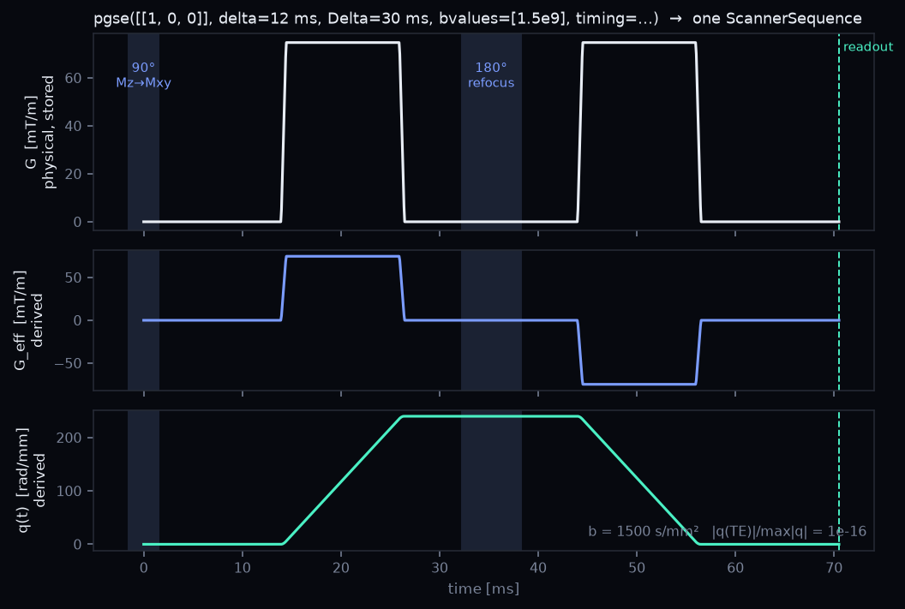

# Acquisition — one object, every engine

A `ScannerSequence` is **what the scanner does from t = 0 to the readout**: the physical
gradient `G(t)`, the RF pulses, the readout, and the timing budget they sit in. You build it once
with a *builder* and hand the same object to the simulator, the replay, the fitter and the
designer. There is no second spelling of an acquisition anywhere in dmipy.

{ width="100%" }

```python
import dmipy_sim as ds

seq = ds.pgse([[1, 0, 0], [0, 1, 0]], delta=0.010, Delta=0.030, bvalues=[1e9, 2e9])
seq.G.shape, seq.dt            # (2, 1000, 3) T/m on a uniform grid — the physical gradient
seq.rf                         # RFSchedule: a 90° at t = 0 and a 180° at TE/2
seq.b()                        # [1e9, 2e9] s/m², integrated from G and the pulses
seq.refocusing_residual        # ~1e-16: q(TE) = 0, the spin echo refocuses
```

## What is stored, what is derived

**Stored**: `G` `(n_meas, n_t, 3)` in T/m, `dt`, the `rf` schedule (`RFEvent`s: time, flip, phase,
duration, optional finite `B1Pulse` envelope), the `readout` samples, the `timing` budget, the
per-measurement `encoding` (b, direction, δ, Δ, TE, the OGSE fields), an optional `crusher`, and
the `build_spec` that reproduces the object.

**Derived, never carried as a flag**: the effective gradient `G_eff` (G folded by the sign the
pulses impose), the coherence mask `chi_perp`, the mixing time `TM`, `stimulated_echo`, the
`echoes`, `b()`, `btensor()`, `refocusing_residual`, and `validate()` — which checks that the
pulses fit their windows, the dead times are honoured, the TE is at or above the encoding's floor,
and q refocuses at the readout.

## Build it

One builder per family. Each takes the directions and either `bvalues=` (the exact b to realise;
the amplitude is iterated) or `gradient_strengths=` (the amplitude to play), plus `TE=`, `n_t=`,
`slew_rate=` (`np.inf` is the square-lobe idealisation) and a `timing=` budget. A builder
**refuses what cannot be played**: a ramp longer than its lobe, an OGSE block with a fractional
number of periods, a cosine above the slew limit, a TE below the encoding's floor.

| Builder | Plays | Parameters |
|---|---|---|
| `pgse(dirs, delta, Delta)` | spin echo, two lobes, the 180 midway | δ, Δ |
| `pgste(dirs, delta, TM)` | the 3×90 stimulated echo: dephase, store along z over TM, recall, rephase | δ, TM (TE = 2δ + TM by default) |
| `ogse(dirs, f, sigma, shape=)` | one oscillating block per side of the 180, `"trapezoid"` (Drobnjak trains) or `"cosine"` | f, σ (whole periods), optional Δ |
| `cpmg(n_echoes, TE, polarity=)` | a refocusing train, an echo read at every k·TE | n, TE, `"constant"` or `"alternate"` diffusion lobes |
| `gre(TE)` | gradient echo, optionally with a self-refocusing diffusion pair | TE, optional δ, Δ |
| `ste(sigma)` / `pte(normal, sigma)` | spherical / planar b-tensor encoding | σ |
| `sequences.from_waveform(G, dt, dirs)` | any effective gradient you already have; b integrated numerically | refused if it does not refocus |

```python
import numpy as np
from dmipy_sim import pgste, ogse, cpmg, ste

stim  = pgste([[0, 0, 1]], delta=0.006, TM=0.040, bvalues=[1e9])         # TM stored along z
osc   = ogse([[1, 0, 0]], 50.0, 0.040, shape="cosine", bvalues=[1e9])   # 2 whole periods per block
train = cpmg(8, 0.020, gradient_directions=[[1, 0, 0]], bvalues=[2e8])    # an echo every 20 ms
iso   = ste(0.060, bvalues=[1e9])                                         # b_delta = 0, 60 ms of encoding
stim.TM, stim.stimulated_echo, osc.encoding.n_oscillation_cycles, len(train.echoes)
```

## Use it everywhere

```python
# docs: skip  (each line is a separate workflow; see the pages linked below)
E   = ds.simulate(20_000, 2e-9, waveform=seq, geometry=ds.Cylinder(radius=4e-6))   # Monte Carlo
E   = pack.replay(seq)                                       # a stored walk, any acquisition
sch = AcquisitionScheme(seq)                                 # dmipy-fit reads the same object
to_pulseq(seq, system=ds.ScannerLimits.of("prisma").pulseq_dict(), filename="dwi.seq")
```

The forward simulator ([Simulate](sim.md)), the replay pack, dmipy-fit's `AcquisitionScheme`
([Fit](fit.md)) and the Pulseq export ([Scanners & Pulseq](pulseq.md)) all read this object and
nothing else. A designed waveform comes back as one too: `design_waveform_now(...).to_sequence()`
([Design](design.md)).

## Mixed protocols

Measurements that differ in TE or in family live in a `Protocol`: a tuple of sequences with the
acquisition order in `rows`. The simulator and the replay run each sequence and scatter the signals
back into acquisition order; dmipy-fit builds one automatically when a scheme spans several echo
times, and normalises the signal per TE (every TE needs its own b = 0).

```python
from dmipy_sim import Protocol

short = ds.pgse([[1, 0, 0]] * 2, 0.010, 0.030, bvalues=[0, 1e9])
long_ = ds.pgse([[1, 0, 0]] * 2, 0.010, 0.030, bvalues=[0, 1e9], TE=0.090)
prot  = Protocol([short, long_])
prot.n_meas, prot.echo_times            # 4 measurements, two echo times
```

## Hardware in the loop

The timing budget and the scanner are objects too, and a builder honours both.

```python
from dmipy_sim import SequenceTiming, ScannerLimits

budget = SequenceTiming.from_readout(t_excite=3e-3, t_refocus=6e-3,
                                     readout_duration=30e-3, partial_fourier=0.75)
seq = ds.pgse([[1, 0, 0]], 0.012, 0.030, bvalues=[1e9], timing=budget)
seq.T                                   # the TE the budget forces: lead-in, pulses, readout tail
[e.duration_s for e in seq.rf]          # the finite 90 and 180 the budget declared

prisma = ScannerLimits.of("prisma")     # the cited catalogue: G_max, slew, rasters, dead times
seq = ds.pgse([[1, 0, 0]], 0.012, 0.030, bvalues=[1e9], slew_rate=prisma.slew_max)
```

Because the lead-in and the readout tail are rarely equal, the encoding windows before and after
the 180 come out unequal — asymmetry is a *consequence* of the budget, not a knob. That is what
[dmipy-design](design.md) optimises inside.

## The specification

The data model and the derivation rules (the sign function, `G_eff`, the coherence mask, the
validation windows) are written down language-neutrally in
[`ACQUISITION.md`](https://github.com/dmrai-lab/replay-pack-spec/blob/main/ACQUISITION.md), so a
pack consumer outside Python can read an acquisition the same way.
