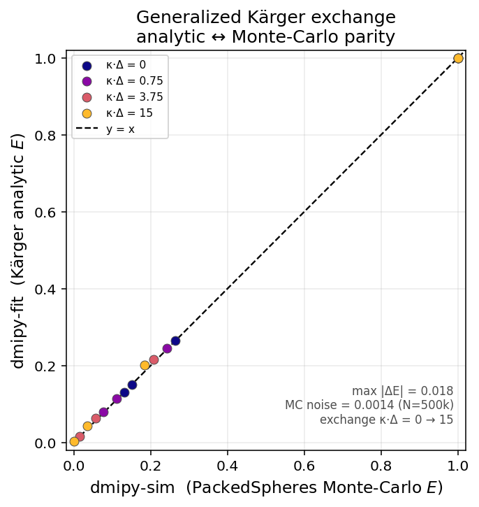

# Generalized Kärger exchange (and NEXI)

Derivation note for the water-exchange models in
`dmipy_fit.signal_models.exchange_models` — `X0GeneralizedKarger` wraps *any two*
compartments with Kärger exchange. NEXI (Stick + Zeppelin with the tortuosity constraint) is
just that general model with a pre-wired link, exposed as `reference_models.nexi()` — no
special class. GPU forward functions live in `dmipy_fit.jax.exchange_models_jax`.

**What it is.** When a compartment boundary is *permeable*, spins cross between
environments during the acquisition, so the signal is no longer a fixed-fraction sum of
independent compartments. The Kärger model is the **compartment-population** description of
that exchange: instead of tracking individual walkers (as the `dmipy-sim` Monte-Carlo does,
where exchange emerges from wall-crossing events), it evolves the *populations* of the
compartments under a coupled linear system. "Generalized" here means the two compartments are
arbitrary `dmipy-fit` models — not hard-wired to a specific stick/ball pair.

## The exchange system

For two exchanging compartments write the pathway amplitudes as $\mathbf M(t)\in\mathbb R^2$
with initial populations $M_{0,i} = f_i S_{0,i}$. The magnetisation evolves under a coupled
linear ODE combining exchange, relaxation and diffusion,

$$
\frac{d\mathbf M}{dt} \;=\; \bigl[\,\mathbf K \;-\; \mathbf R(t) \;-\; \mathbf D(t)\,\bigr]\,\mathbf M ,
$$

where $\mathbf K$ is the exchange-rate matrix

$$
K_{ij} = k_{ji}\ (i\neq j), \qquad K_{ii} = -\sum_{m\neq i} k_{im},
$$

$\mathbf R(t)$ is the (diagonal) relaxation operator and $\mathbf D(t)=\mathrm{diag}(q^2(t)\,D_i)$
the Gaussian diffusion-attenuation operator.

### Detailed balance is on spin *populations*, not volumes

The exchange rates satisfy detailed balance of the **spin populations**:

$$
(f_i S_{0,i})\,k_{ij} \;=\; (f_j S_{0,j})\,k_{ji},
$$

where $f_i$ is the geometric volume fraction and $S_{0,i}$ the proton-density-weighted
equilibrium signal. When proton densities are equal this reduces to the familiar
$f_i k_{ij} = f_j k_{ji}$ — but for compartments with different water content per unit volume
(e.g. **myelin water vs. free water**) the product $f_i S_{0,i}$ (the spin population), not the
geometric volume, is what must balance. Getting this wrong biases the recovered exchange rate.

## Spin-echo (PGSE): one interval, per-compartment $T_2$

In the instantaneous-RF limit the whole echo is a single transverse interval, so the ODE
integrates to a matrix exponential,

$$
\mathbf M(\mathrm{TE}) \;=\; \exp\!\Bigl(\bigl[\mathbf K - \mathbf R_{T_2}\bigr]\,\mathrm{TE} \;-\; b\,\mathrm{diag}(D_i)\Bigr)\,\mathbf M_0,
\qquad \mathbf R_{T_2}=\mathrm{diag}(1/T_{2,i}).
$$

This is the standard two-Gaussian-compartment Kärger result **with per-compartment $T_2$** —
each compartment relaxes at its own transverse rate *while* exchanging, and because $\mathbf K$
and $\mathbf R_{T_2}$ do not commute the coupling is not separable (you cannot factor exchange
and relaxation apart).

## Stimulated echo (PGSTE): $T_1$ governs the mixing interval

In a stimulated-echo experiment the magnetisation is stored *longitudinally* during the mixing
time $T_M$. There, $T_2$ no longer acts — **$T_1$** relaxation (and exchange) act instead — while
$T_2$ acts during each of the two transverse encoding lobes of duration $\delta$:

$$
\mathbf M(\mathrm{TE}) = \tfrac12\,
\underbrace{\exp\!\Bigl([\mathbf K-\mathbf R_{T_2}]\delta - \tfrac{b}{2}\mathrm{diag}(D_i)\Bigr)}_{\text{encode (transverse, }T_2)}
\underbrace{\exp\!\Bigl([\mathbf K-\mathbf R_{T_1}]\,T_M\Bigr)}_{\text{store (longitudinal, }T_1)}
\underbrace{\exp\!\Bigl([\mathbf K-\mathbf R_{T_2}]\delta - \tfrac{b}{2}\mathrm{diag}(D_i)\Bigr)}_{\text{encode (transverse, }T_2)}
\mathbf M_0,
$$

with $\mathbf R_{T_1}=\mathrm{diag}(1/T_{1,i})$ and the $\tfrac12$ stimulated-echo pathway
factor. The consequence is physically important: PGSTE lets exchange act over a long $T_M$ under
$T_1$ (typically $\gg T_2$), so the stimulated echo is **more sensitive to slow exchange** than
a spin echo of the same diffusion weighting — and the two compartments' $T_1$ values, not their
$T_2$, weight the stored populations.

Both forms extend to **finite-RF** pulses by inserting a per-interval matrix exponential for
each pulse duration (with mixed $T_1/T_2$ relaxation during the pulse) and evaluating the whole
sequence as an ordered product of matrix exponentials — which is what `exchange_models.py` does
(`_karger_propagator_se`, `_karger_propagator_ste`).

## Validity, and where the Monte-Carlo takes over

The Kärger picture is a **slow-exchange** approximation. It holds when exchange is slow relative
to both intra-compartment diffusion and relaxation,

$$
k_{ij} \ll D_i/R_i^2, \qquad k_{ij} \ll 1/T_{2,i},
$$

($R_i$ = compartment size). Outside that regime — in particular once $k\,\Delta \gtrsim 1$ under
typical PGSE timing — the Kärger formula **systematically under-estimates** exchange-induced
signal change, and the `dmipy-sim` Monte-Carlo (where exchange is a genuine wall-crossing event
along each trajectory, not a population rate) is the reference. Agreement between the analytical
Kärger model and the MC in the slow regime is a **consistency check** on the interface, not a
proof that either is correct outside it.



Within that regime the analytical `X0GeneralizedKarger` (GPA sphere + Ball) reproduces the
`dmipy-sim` PackedSpheres Monte-Carlo across exchange strengths $\kappa\,\Delta = 0 \to 15$ to
within Monte-Carlo noise (max $|\Delta E| = 0.018$, MC noise $0.0014$ at $N=500\text{k}$) — every
point on the identity line.

## In code

```python
from dmipy_fit.signal_models.exchange_models import X0GeneralizedKarger

# NEXI = Stick + Zeppelin + tortuosity, built via the general Kärger model:
from dmipy_fit.custom_optimizers.reference_models import nexi
model = nexi()

# or wrap ANY two compartments with Kärger exchange directly:
from dmipy_fit.signal_models.cylinder_models import C1Stick
from dmipy_fit.signal_models.gaussian_models import G1Ball
model = X0GeneralizedKarger(model_intra=C1Stick(), model_extra=G1Ball())
```

Per-compartment `T2`/`T1` are picked up from the compartments when present (falling back to a
global `T2` or to no relaxation); the SE vs. PGSTE propagator is selected from the acquisition
scheme (mixing time $T_M$). See also the
[GPA-for-arbitrary-waveforms derivation](gpa_arbitrary_waveform.md) and
[Acquisition sequences](../sequences.md).
