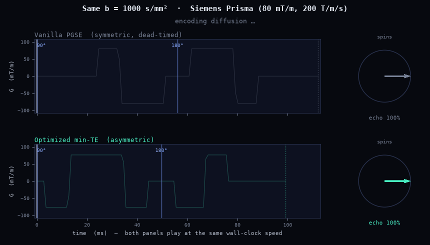

# Deliverable waveforms & constraints

Textbook diffusion MRI assumes an **idealized** encoding: instantaneous, infinitely sharp
gradient pulses, a perfectly rectangular PGSE pair, symmetric about the 180. A real scanner can
play none of that exactly. dmipy-design closes the gap — it designs the waveform a scanner can
*actually* deliver, and the constraints below are why the realizable optimum differs from the
textbook one.

## Idealized vs deliverable

| Idealized theory | Real hardware |
|---|---|
| instantaneous gradient switching | finite **slew rate** (T/m/s) and **gradient raster** |
| unbounded amplitude | maximum **G** (T/m) |
| rectangular PGSE, symmetric | encoding **windows** set by RF/ADC timing → often **asymmetric** |
| no physiological limits | **PNS** (nerve stimulation) and gradient **heating** caps |

## Asymmetric encoding windows

The 180 refocusing pulse sits at TE/2, but diffusion encoding is **off** during three intervals:
the excitation lead-in (after the 90), the 180 itself (plus its crushers), and the readout tail
(before the echo). Because the lead-in and the readout-pre-echo are generally *unequal* — and
**partial Fourier** shortens the post-180 window further — the two remaining encoding windows
(pre- and post-180) come out **different lengths**.

So the optimal waveform is **asymmetric as a consequence of the timing, not as a free knob**. You
don't dial in "0.3 asymmetry"; you specify the physical budget (`SequenceTiming`, or read it from
a `.seq`), and the asymmetry falls out. Forcing symmetry (the conventional choice) *dead-times*
the surplus of the longer window — spins sit transverse doing nothing but losing $T_2$ — so it
encodes less b for the same TE.

### See it: same b, shorter TE

Both sequences below encode the **same** b-value (1000 s/mm²) on the **same** hardware — real
Siemens Prisma limits (80 mT/m, 200 T/m/s, 10 µs raster) with a realistic single-shot
diffusion-EPI budget (short excitation lead-in, long EPI readout-to-echo). They play at the
**same wall-clock speed**, so you can watch the optimized asymmetric design refocus first:

{ width="100%" }

The vanilla symmetric sequence dead-times its long pre-180 window down to the short post-180 one,
so it needs **TE = 112 ms**; the asymmetric design fills the real budget and reaches the same b at
**TE = 99 ms** — **13 ms sooner**, worth ≈ **1.17× SNR** at $T_2 = 80$ ms ($e^{\Delta\mathrm{TE}/T_2}$).
Same contrast, more signal, purely from respecting the timing the scanner actually has. This is
the [min-TE mode](snr.md) at work.

## The NOW constraint set — and why each exists

The **NOW** oracle maximises $b = \mathbf{g}^\top \mathbf{Q}\, \mathbf{g}$ subject to the full
deliverability set, each constraint enforced *exactly* (active-set SQP), so the b-value reaches the
true realizable optimum rather than being dwarfed by penalty terms:

| Constraint | Why it's there |
|---|---|
| **slew** \|dG/dt\| ≤ S_max, **amplitude** \|G\| ≤ G_max | the hardware simply cannot exceed them |
| **refocus** $q(\mathrm{TE})=0$ | a spin echo must rephase static spins at the echo, else signal is lost |
| **M1 / M2 nulling** (velocity, acceleration) | uncompensated moments make the signal sensitive to bulk **motion / flow**, biasing the diffusion estimate |
| **b-tensor shape** ($b_\Delta$) | LTE / PTE / STE encode different tissue information; the shape must be hit, not approximated |
| **Maxwell** (concomitant fields) | gradient cross-terms produce a spatially varying field that dephases signal unless nulled |
| **spectral** (RMS frequency) | OGSE-like frequency content — see [OGSE spectral design](spectral.md) |
| **PNS** (SAFE model) | see below |
| **heat** ($\int g^2$) | duty-cycle / coil-heating budget on long protocols |

M1/M2 and Maxwell default **on**: a *needed-but-off* constraint biases the measurement, while an
*unneeded* one only costs a little b (SNR). You turn one off only when its confound is physically
absent.

## Why PNS is a hard constraint

Rapidly switching gradients induce electric fields in the body that can stimulate peripheral
nerves — an uncomfortable (and regulated) limit, not just an engineering one. Vendors accept or
reject a sequence against a **PNS model** (the SAFE model; IEC 60601-2-33). Without a PNS
constraint, a b-maximiser would happily ride the slew rate to the hardware maximum everywhere and
produce a waveform the scanner **refuses to run** (or that stimulates the patient). dmipy-design
holds PNS ≤ a target (e.g. 80 % of the stimulation limit) *inside* the design, so what comes out is
deliverable — and `pulseq_pns_report` re-checks the assembled `.seq` with the same model the
scanner uses.

## The payoff: it exports and passes acceptance

Because deliverability is designed in rather than checked after the fact, a design exports to a
scanner-runnable Pulseq spin echo and passes the offline acceptance checks — timing, realized peak
G/slew vs the system limits, and a **b-tensor round-trip** (what you asked for == what the
assembled sequence actually encodes).
