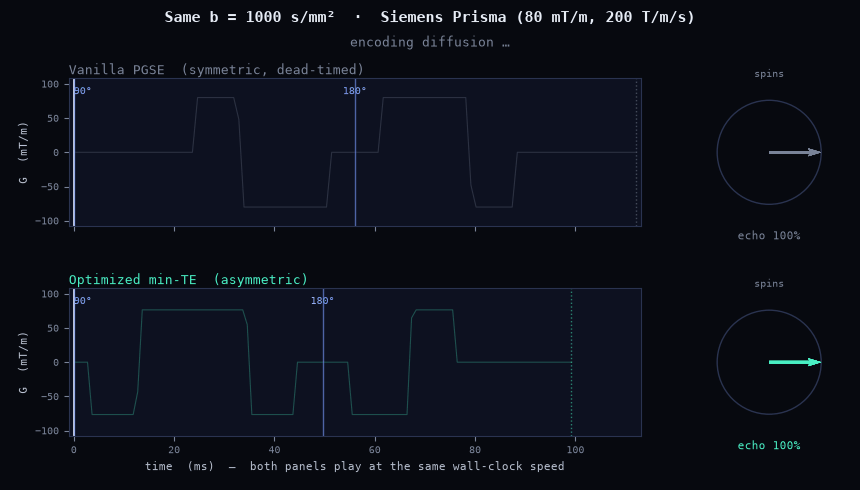
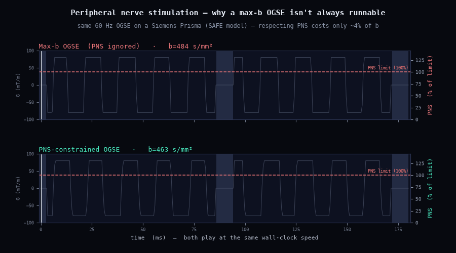

# Deliverable waveforms & constraints

Textbook diffusion encoding is instantaneous, rectangular and symmetric about the 180. A scanner
plays none of that. dmipy-design designs the waveform a scanner can *actually* deliver, and the
constraints below are why the realisable optimum differs from the textbook one.

| Idealised theory | Real hardware |
|---|---|
| instantaneous switching | finite **slew rate** and gradient **raster** |
| unbounded amplitude | maximum **G** |
| rectangular, symmetric PGSE | encoding **windows** set by the RF and readout timing, usually **asymmetric** |
| no physiology | **PNS** (nerve stimulation) and gradient **heating** caps |

## Asymmetry is a consequence, not a knob

The 180 sits at TE/2, and encoding is off during the excitation lead-in, the 180 with its
crushers, and the readout tail before the echo. Lead-in and readout tail are rarely equal, and
partial Fourier shortens the tail further, so the two encoding windows come out different
lengths. You specify the budget (`SequenceTiming`, or read it from a `.seq`) and the asymmetry
falls out. Forcing symmetry dead-times the surplus of the longer window: spins sit transverse
losing T2 for no b.

{ width="100%" }

Grey bands are the scanner's fixed off-times, identical on both panels; the amber band is the
dead time the vanilla adds to stay symmetric. Same b, TE 80 ms versus 65 ms: about 1.2× the
signal at T2 = 80 ms, purely from respecting the timing the scanner has. This is
[min-TE](snr.md) at work.

## The constraint set

NOW maximises b = gᵀQg with active-set SQP, each constraint held exactly:

| Constraint | Why |
|---|---|
| slew, amplitude | the hardware cannot exceed them |
| refocus q(TE) = 0 | a spin echo must rephase static spins at the echo |
| M1 / M2 nulling | uncompensated moments make the signal sensitive to bulk motion and flow |
| b-tensor shape (b_Δ) | LTE / PTE / STE encode different tissue information; the shape is hit, not approximated |
| Maxwell | concomitant fields dephase signal unless the cross-terms are nulled |
| spectral (f_rms) | OGSE-like frequency content — [spectral design](spectral.md) |
| PNS (SAFE) | the vendor's own acceptance model, IEC 60601-2-33 |
| heat (∫g²) | duty-cycle budget on long protocols |

**When to turn one on.** A needed-but-off constraint *biases* the measurement; an unneeded-but-on
one only costs a little b. So the biasing constraints default on, and you turn one off only when
its confound is absent: M1/M2 for body and cardiac diffusion, off for a still head; Maxwell for
high amplitude, off-isocentre or asymmetric waveforms, essentially free otherwise; PNS and heat
always, they are deliverability.

## PNS as a hard constraint

Without it a b-maximiser rides the slew limit at every edge and produces a waveform the scanner
refuses. dmipy-design holds the SAFE-model PNS at a target (80 % of the stimulation limit) inside
the design, and `pulseq_pns_report` re-checks the assembled `.seq` with the same model.

{ width="100%" }

Because deliverability is designed in, the result exports to a scanner-runnable Pulseq spin echo
and passes the offline acceptance checks: [run it on the scanner](pulseq.md).
