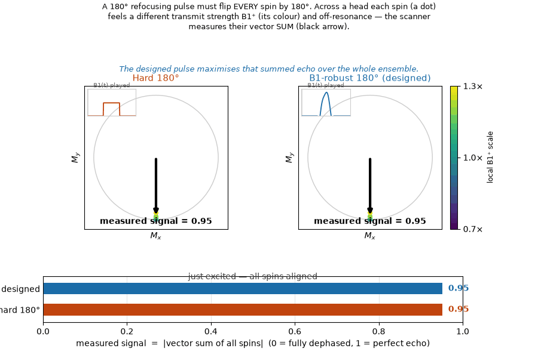
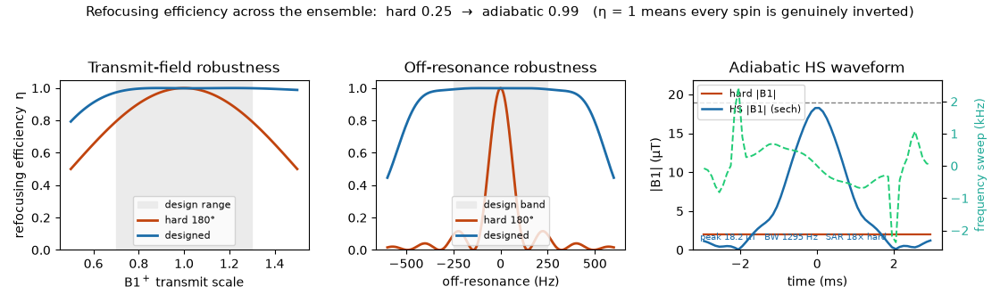

# B1-robust refocusing RF

A hard 180 inverts every spin only where the transmit field is nominal. Across a head B₁⁺ varies
by tens of percent, so the same pulse is a 126° at B₁⁺ = 0.7 and a 234° at 1.3; those spins are
never properly flipped and the echo built on them is incomplete. The scanner-deliverable fix is
an **adiabatic pulse**: sweep the frequency through resonance while the amplitude rises and
falls, and the magnetization follows the effective field from +z to −z regardless of B₁⁺.

{ width="100%" }

`design_refocusing_rf` builds the hyperbolic-secant adiabatic full passage (Silver, Joseph &
Hoult 1985) tuned to the hardware, then refines it with a short GRAPE pass warm-started from it,
so the result stays a smooth deliverable spiral. It is scored by the crushed spin-echo
refocusing efficiency η = ½(1 − M_z), averaged over the B₁⁺ × off-resonance ensemble, through
dmipy-sim's Bloch forward: every spin must genuinely invert.

```python
from dmipy_design import design_refocusing_rf

d = design_refocusing_rf(rf_duration=6e-3, dt=1e-4, B1_max=19e-6,        # 6 ms on a 100 µs raster, body coil
                         b1_range=(0.7, 1.3), n_b1=5, off_resonance_hz=250.0, n_off_resonance=5,
                         refine=False)                                    # the HS warm start alone
d.refocusing_efficiency, d.refocusing_efficiency_hard    # ≈0.99 vs ≈0.25 for a hard 180°
d.peak_B1, d.sar_ratio                                   # the delivered peak and the SAR price
ev = d.to_rf_event(0.030)                                # an RFEvent for a ScannerSequence's schedule
```

{ width="100%" }

Peak-limited on a 19 µT body coil, the hard 180 refocuses η = 0.25 of a ±30 % / ±250 Hz ensemble;
the HS pulse reaches η = 0.99 at 18.9 µT for about 17× the RF energy. Same echo time, far more
signal; SAR is the honest cost of adiabaticity.

Pushed to a hard spec (±50 % B₁⁺ and ±500 Hz on 5 ms / 19 µT) the layers separate: hard 0.14, HS
warm start 0.91, HS + GRAPE 0.92 while trimming the peak from 18.9 to 16.3 µT.

{ width="100%" }

!!! note "Refocusing vs inversion"
    An adiabatic full passage imparts a B₀/B₁-dependent phase, so as a refocusing pulse it is used
    as a matched pair (double adiabatic refocusing, LASER); η here is the single-pass |β|²
    coefficient. `to_rf_event(t)` labels the event as the refocusing pulse, and dmipy-sim's
    `refocus_time` follows that label even though the envelope's nutation is not 180°.

## References

- Silver MS, Joseph RI, Hoult DI. *Highly selective π/2 and π pulse generation.* JMR 59 (1984);
  Phys. Rev. A 31 (1985) 2753.
- Tannús A, Garwood M. *Adiabatic pulses.* NMR Biomed 10 (1997) 423.
- Pauly J, Le Roux P, Nishimura D, Macovski A. *Parameter relations for the Shinnar–Le Roux
  selective excitation pulse design algorithm.* IEEE TMI 10 (1991) 53.
