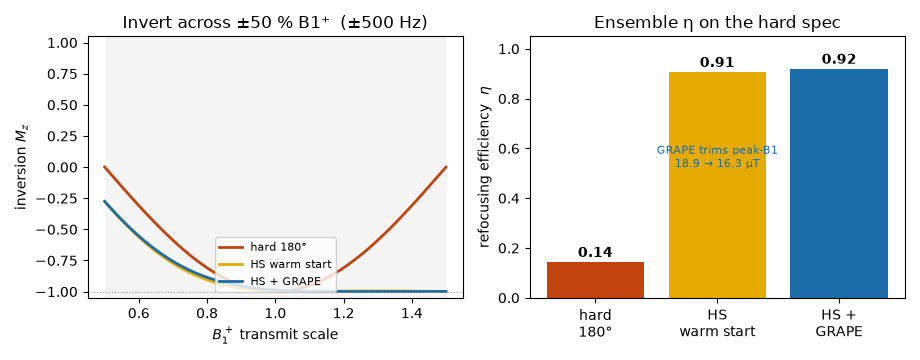

# B1-robust refocusing RF

The rest of dmipy-design works in the **instant-pulse** approximation — an ideal hard 180° that
inverts every spin perfectly, everywhere. A real refocusing pulse does not. Across a head the
transmit field $B_1^+$ varies by tens of percent, so a hard 180° that is exactly π at the coil
centre becomes a 126° at $B_1^+=0.7$ and a 234° at $B_1^+=1.3$ — the off-nominal spins are never
properly flipped, the spin echo built on them is incomplete, and that is signal you simply lose.

The standard, scanner-deliverable fix is an **adiabatic pulse**: sweep the RF frequency slowly
through resonance while the amplitude rises and falls, and — provided the sweep is slow enough
(the *adiabatic condition*) — the magnetisation **follows the effective field** from +z to −z
*regardless* of the exact $B_1^+$. `design_refocusing_rf` builds the classic **hyperbolic-secant
(HS) adiabatic full passage** (Silver, Joseph & Hoult 1985) tuned to your hardware, then **refines
it with a short optimal-control (GRAPE) pass** — the HS pulse is the good initial guess that keeps
the refinement physical.

It is the **RF analogue of the [NOW gradient box](deliverable.md)**: design a *deliverable*
waveform that meets a physical spec under the real hardware limits — here $B_1(t)$ instead of
$G(t)$.

![Three spins are followed on the Bloch sphere (rotating frame): weak-transmit (B1⁺ 0.7×, purple), nominal (1.0×, black), strong (1.3×, gold). Under the hard 180° (left) only the nominal spin reaches −z; the weak and strong spins under/over-rotate and stall near the equator (Mz ≈ −0.6, not inverted). Under the adiabatic HS pulse (right) all three FOLLOW the swept effective field and spiral smoothly down to −z (Mz ≈ −1), regardless of B1⁺. The RF waveform playing below is the HS amplitude (a smooth sech rise-and-fall).](media/rf_refocus.gif){ width="100%" }

New to RF pulses? The [RF pulses — watch the spins](../rf_pulses.md) page (dmipy-sim) shows what
a $B_1(t)$ envelope *is* and how the Bloch forward plays any pulse — this page designs one.

## Idealized vs real refocusing

| Idealized theory | Real hardware |
|---|---|
| instantaneous, perfect π everywhere | finite-duration pulse; a fixed-flip pulse's angle scales with $B_1^+$ |
| single on-resonance spin | a spread of static **off-resonance** ($B_0$, susceptibility) |
| unbounded RF | **peak $B_1$** cap (body-coil hardware limit) and **SAR** (heating) |
| any shape | bandwidth / **RF slew** limited by the transmit chain |

## Why the adiabatic pulse is robust — and how it's scored

An adiabatic pulse doesn't try to hit exactly 180°; it makes the effective field *sweep* from
far above resonance, through zero, to far below, and the magnetisation is dragged along with it.
Change $B_1^+$ and the sweep is a little faster or slower, but as long as it stays adiabatic the
spin still arrives at −z — that is the source of the robustness, and why every trajectory above
is a smooth spiral rather than a delicate balance.

The figure of merit is the crushed spin-echo **refocusing efficiency**

$$\eta = \tfrac12\,(1 - M_z) \in [0,1],\qquad M_z = \text{the pulse acting on } +z,$$

($\eta = 1$ for a perfect inversion, $|\beta|^2$ in Shinnar–Le-Roux terms). It is a **per-spin**
scalar, averaged over the $(B_1^+ \times \text{off-resonance})$ ensemble — so every spin must
genuinely invert; it cannot be gamed by cross-spin phase cancellation.

The design maximises $\langle\eta\rangle$ through the Bloch equation in two stages: first it
picks the HS sweep parameter $\mu$ (and, under a SAR cap, the amplitude) — a robust, physical
starting pulse; then a **GRAPE-style refinement** optimises a few *smooth* correction modes of the
full waveform, warm-started from that pulse. Because it starts in the adiabatic basin and the
corrections are band-limited, the result stays a smooth deliverable spiral — it does **not** wander
into a non-physical optimum the way a free-form search from a cold start does. (A generic optimiser
with no good initial guess is exactly what fails here; the adiabatic pulse *is* the initial guess.)
The refinement typically buys a little efficiency and peak-$B_1$ headroom at equal SAR.

{ width="100%" }

## Deliverability — and the price of robustness

The amplitude is set to the deliverable peak (**$A_0 = B_1^{\max}$** — adiabaticity improves with
amplitude, so you spend the coil's full peak), and the sweep bandwidth is chosen to cover the
off-resonance band. Adiabatic pulses are **power-hungry**: following the field robustly costs RF
energy — here ≈17× the SAR of a minimal hard 180°. `sar_headroom` caps that (as a multiple of the
hard-180° energy) by lowering $A_0$; left `None` the design is peak-limited (most robust) and
reports the SAR it spent.

| Limit | RF analogue of | Role |
|---|---|---|
| **peak $B_1 = A_0 \le B_1^{\max}$** | gradient amplitude box | hard hardware ceiling |
| **SAR $\propto \int\lvert B_1\rvert^2 dt$** | gradient heat limit | the price of adiabaticity |

## Use it

```python
from dmipy_design import design_refocusing_rf

d = design_refocusing_rf(
    rf_duration=6e-3, dt=1e-4,      # 6 ms pulse on a 100 µs RF raster
    B1_max=19e-6,                   # GE SIGNA Premier body coil ≈ 19 µT (hard peak limit)
    sar_headroom=None,              # peak-limited (most adiabatic); or e.g. 8.0 to cap SAR
    b1_range=(0.7, 1.3), n_b1=7,    # ±30 % transmit inhomogeneity to invert across
    off_resonance_hz=250.0, n_off_resonance=7,   # ±250 Hz band the sweep must cover
    refine=True,                    # GRAPE refinement from the HS warm start (default)
)

d.refocusing_efficiency        # ensemble-mean η (0–1); 1 = every spin inverted
d.refocusing_efficiency_hard   # same metric for a plain hard 180° — the baseline
d.B1                           # complex B1 envelope, Tesla
d.mu, d.beta, d.bandwidth_hz   # the adiabatic (HS) backbone parameters
d.refined                      # True if the GRAPE pass improved on the HS template
d.peak_B1, d.sar_ratio         # delivered peak and SAR (× hard-180°)
```

Peak-limited on a 19 µT body coil, the hard 180° refocuses only **η = 0.25** of the ±30 % /
±250 Hz ensemble; the HS adiabatic pulse reaches **η = 0.99** — every spin inverted — at
**18.9 µT** peak, a **≈1.3 kHz** inversion band, for **≈17×** the RF energy of a hard 180°. Same
echo time, far more signal; the SAR is the honest cost of adiabaticity.

## Pushing it: the optimiser at the edge

On an easy spec the adiabatic warm start is already near-perfect and the GRAPE pass barely
matters. Push to a **hard** spec — invert across **±50 % B1⁺** *and* ±500 Hz on a 19 µT / 5 ms
budget — and the layers separate: a hard 180° is hopeless (η = 0.14), the HS warm start does the
heavy lifting (η = 0.91), and the GRAPE refinement squeezes out the last bit of efficiency while
*trimming* peak-B1 (18.9 → 16.3 µT of headroom):

{ width="100%" }

This is dmipy-design's own optimiser working at the edge of what a 5 ms / 19 µT pulse can do —
and a taxonomy of *fixed* robust pulses (adiabatic HS, BIR-4, composites; see
[RF pulses — watch the spins](../rf_pulses.md)) is exactly the space of warm starts it refines from.

!!! note "Refocusing vs inversion"
    An adiabatic *full passage* imparts a $B_0/B_1$-dependent phase, so as a **refocusing** pulse
    it is used as a matched **pair** (double adiabatic refocusing, e.g. LASER) to cancel that
    phase; the crushed-echo $\eta$ here is the single-pass $|\beta|^2$ refocusing coefficient.
    The pulse is designed in isolation (not coupled to the gradient); `d.to_b1pulse()` hands it to
    dmipy-sim's Bloch forward. NumPy/SciPy only.

## References

The hyperbolic-secant adiabatic pulse and the crushed-echo / SLR refocusing efficiency are
established; dmipy-design provides a NumPy/SciPy design + Bloch scoring, not an external library.

- **Hyperbolic-secant adiabatic pulse.** Silver MS, Joseph RI, Hoult DI. *Highly selective π/2
  and π pulse generation.* Journal of Magnetic Resonance **59** (1984) 347–351; and *Phys. Rev. A*
  **31** (1985) 2753. [doi:10.1103/PhysRevA.31.2753](https://doi.org/10.1103/PhysRevA.31.2753).
- **Adiabatic pulses — review.** Tannús A, Garwood M. *Adiabatic pulses.* NMR in Biomedicine
  **10** (1997) 423–434.
  [doi:10.1002/(SICI)1099-1492(199712)10:8<423::AID-NBM488>3.0.CO;2-X](https://doi.org/10.1002/(SICI)1099-1492(199712)10:8%3C423::AID-NBM488%3E3.0.CO;2-X).
- **Refocusing efficiency / SLR.** Pauly J, Le Roux P, Nishimura D, Macovski A. *Parameter
  relations for the Shinnar–Le Roux selective excitation pulse design algorithm.* IEEE
  Transactions on Medical Imaging **10** (1991) 53–65.
  [doi:10.1109/42.75611](https://doi.org/10.1109/42.75611).
