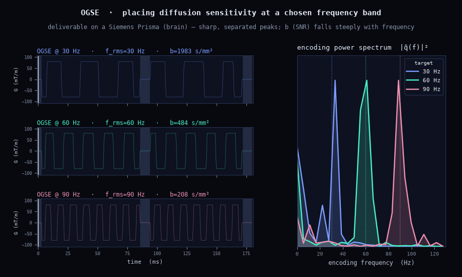

# OGSE spectral design

PGSE and OGSE with the same b-tensor encode the same Gaussian signal; what separates them is
*where in frequency* the encoding power sits. The signal is, to first order,
ln S ≈ −∫ D(ω) |q̃(ω)|² dω, so a waveform is a filter on the diffusion spectrum D(ω): restricted
water has a rising D(ω), exchange a falling one, and the b-value alone cannot see either.

`design_waveform_now` always reports the encoding spectrum's RMS frequency, and
`spectral_freq=f` adds an equality constraint that pins it — the same SQP, one more analytic
Jacobian.

```python
from dmipy_design import design_waveform_now, ScannerLimits, encoding_spectrum

lim  = ScannerLimits.of("prisma")
pgse = design_waveform_now(1.0, limits=lim, TE=0.080, n_t=100, n_restarts=2, seed=0)
ogse = design_waveform_now(1.0, limits=lim, TE=0.080, n_t=128, n_restarts=2, seed=0, spectral_freq=60.0)
round(pgse.spectral_rms), round(ogse.spectral_rms)          # a few Hz  vs  ≈ 60 Hz
ogse.b_value < pgse.b_value                                  # the OGSE efficiency cost at equal TE
```

{ width="100%" }

Higher frequency costs b at a fixed TE and slew: the lobes shorten, so less area fits under the
amplitude ceiling. The PNS constraint binds first on the fast designs.

{ width="100%" }

## Simulate and fit the same object

`ogse.to_sequence()` is a `ScannerSequence`; `encoding_spectrum(seq)` reads the spectrum of any
sequence, designed or built (`dmipy_sim.ogse(...)`). Simulate it on a cylinder, fit it with the
OGSE-aware `C4` model on `AcquisitionScheme(seq)`, and the frequency dependence of the apparent
diffusivity is the restriction size — see [your first simulation](../start/sim.md) for the loop.
