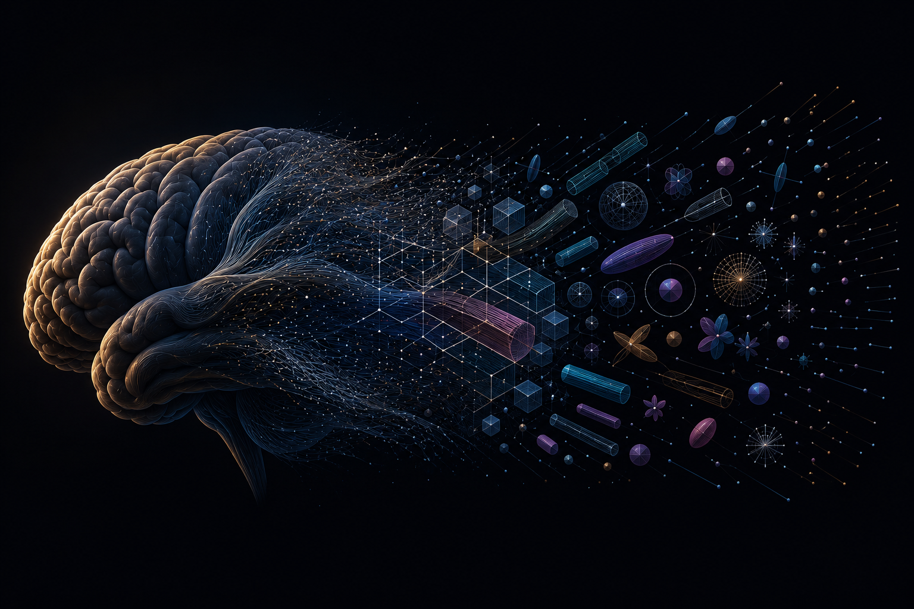

# dmipy

## Reading brain tissue from a physics-complete MRI signal

MRI scanners don't measure brain tissue directly. They measure a **signal**, and a physics model
translates that signal into the numbers researchers and clinicians actually read — *axon
density*, *myelin content*, *tissue microstructure*.

The problem: today's translation models are **incomplete**. Each one accounts for some physical
effects (diffusion, say) while ignoring others that are quietly present in the same signal
(relaxation, magnetic susceptibility, surface interactions). So the numbers coming out of a scan
are subtly biased — in specific, predictable ways — and most tools have no way to tell you when,
or how much.

**dmipy is a translation model built to leave nothing out:** one shared physical description of
the tissue, used to explain *every* signal a scanner can produce — so the numbers mean what
people already assume they mean.

{ width="100%" }

## How it works: two engines, one physical tissue

dmipy describes tissue *once* — a substrate of geometric compartments with their physical
properties — and then looks at it from both directions:

- **[dmipy-fit](https://github.com/dmrai-lab/dmipy-fit)** — the **inverse**: given a measured
  signal, recover the tissue parameters. Analytical multi-compartment models with T2 and surface
  relaxivity as composable factors, CSD, and myelin-water estimation, fit on the GPU. The
  successor to the original [dmipy](https://doi.org/10.3389/fninf.2019.00064) toolbox.
- **[dmipy-sim](https://github.com/dmrai-lab/dmipy-sim)** — the **forward truth**: given a
  tissue, simulate the signal from first principles by random-walking spins through the geometry
  (a Monte-Carlo "ground truth", no analytical shortcuts).

They read the *same* tissue description, so a fit and a simulation built from the same parameters
describe the same tissue — and every analytical model is checked, effect by effect, against the
simulator. Agreement is how we earn trust in the numbers.

## Try it

```python
import numpy as np
from dmipy_fit.core.acquisition_scheme import acquisition_scheme_from_bvalues
from dmipy_fit.signal_models.gaussian_models import G1Ball
from dmipy_fit.signal_models.cylinder_models import C1Stick
from dmipy_fit.core.modeling_framework import MultiCompartmentModel

# a small two-shell scheme (b-values in s/m^2 — multiply s/mm^2 by 1e6)
rng    = np.random.default_rng(0)
bvals  = np.r_[0.0, np.full(32, 1e9), np.full(32, 2e9)]
bvecs  = np.zeros((65, 3)); v = rng.standard_normal((64, 3))
bvecs[1:] = v / np.linalg.norm(v, axis=1, keepdims=True)
scheme = acquisition_scheme_from_bvalues(bvals, bvecs, delta=0.01, Delta=0.03)
data   = rng.uniform(0.1, 1.0, size=(10, 65))        # <- swap in your DWI voxels

ball_stick = MultiCompartmentModel([G1Ball(), C1Stick()])
fit = ball_stick.fit(scheme, data, solver="jax")     # vmap over voxels, GPU if available
print(fit.fitted_parameters.keys())
```

**Start here:** [Install](install.md) → the [inverse](fit.md) or [forward](sim.md) quickstart →
the worked [surface-relaxivity / myelin-water walkthrough](surface_relaxivity_bias.md). Coming
from the 2019 toolbox? See [Migrating from dmipy 1.x](migrating.md).

## The longer game

Diffusion, relaxation, surface relaxivity, exchange — and eventually susceptibility and finite RF
— all read out of the *same* substrate, on the same footing, each paired with its analytical
inverse. What's released **today** is a well-tested slice of that: the transverse-magnetisation
regime (diffusion + T2 + surface relaxivity + permeable exchange, ideal instantaneous pulses).
The *Scope* notes throughout mark the current boundary, not the ceiling.

!!! quote "Physics is the specification"
    Physical laws, invariants, and known analytical results are the correctness criteria — not
    "the code runs". Every analytical model is validated effect-by-effect against Monte Carlo.
    More on the philosophy at **[dmrai-lab.org](https://dmrai-lab.org)**.
