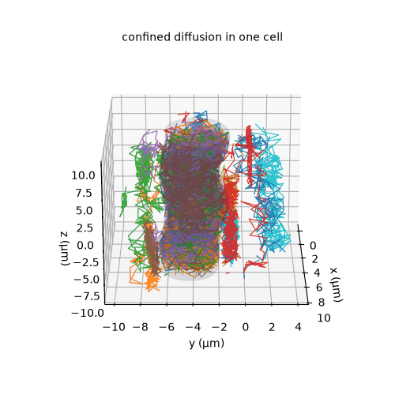
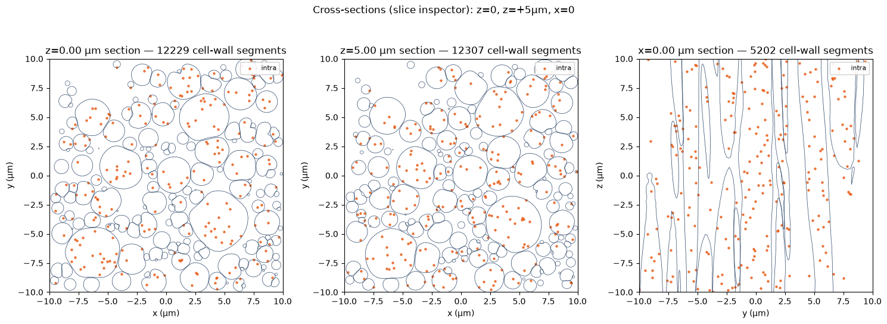
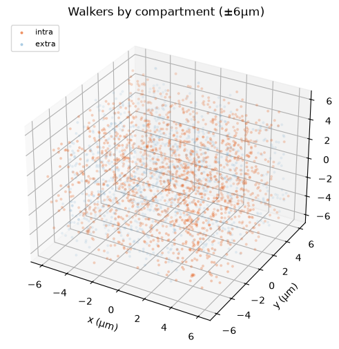

# Mesh substrates

Beyond the parametric geometries (cylinders, spheres, myelinated cylinders), dmipy-sim
runs **arbitrary triangular surface meshes** — the dense, irregular microstructures that
mesh-based substrate generators export as `.ply`. Loading such a file is a first-class,
one-line operation, and the walkers diffuse inside it with the **same physics** as the
analytic geometries: restricted diffusion, surface relaxivity, and membrane permeability.

```python
from dmipy_sim import Mesh, simulate

# load a mesh, scaling normalised coordinates -> metres, as a 3-D-periodic pack
mesh = Mesh.from_ply("substrate.ply", scale=1e-5,
                     periodic=True, voxel_min=[-10e-6]*3, voxel_max=[10e-6]*3,
                     feature_radius=1.7e-6, permeability=2e-5)

mesh.quality_report()                        # per-effect resolution verdict
signal = simulate(n_walkers=50_000, diffusivity=2e-9, waveform=wf, geometry=mesh)
```

Loading needs the optional extra: `pip install "dmipy-sim[mesh]"`.

## What makes it work

- **Spatial acceleration.** A static uniform grid buckets every triangle; each step only
  tests the triangles in the walker's 27-cell neighbourhood, so the per-step cost is
  `O(candidates)` instead of `O(n_triangles)` — a mesh with ~10⁶ triangles goes from
  intractable to seconds.
- **3-D periodicity.** With `periodic=True`, triangles near the box faces are replicated
  as ghosts across to the opposite side; the box faces act as periodic wrap planes, so a
  cell clipped at the boundary is stitched to its partner. Geometry queries use the
  wrapped position while the reported position stays continuous, keeping the gradient
  phase correct.
- **Smooth reflection & leak-proof permeation.** Reflections use an interpolated vertex
  normal (faceting error `O(h²/R²)`), and the Powles crossing is decided once at the first
  membrane hit, with a multi-bounce reflection for the remainder.
- **Placement in the bore.** `orientation=` (or a rotation `R=`) declares how the mesh
  sits relative to the main field (B0 = +z); it is applied as an *acquisition* rotation,
  so the validated walk itself is untouched.

## Accuracy and resolution

A triangulated shape reproduces the analytic signal of the same shape to the Monte-Carlo
noise floor. Restricted diffusion and surface relaxivity reach it even for coarse meshes;
**membrane permeability is more sensitive to the surface tessellation** — its faceting
bias falls as `O(h²)`, so a heavily-decimated mesh under-resolves permeability. `Mesh`
warns at construction, and `quality_report()` gives a per-effect verdict, when the edge
length is too large relative to the feature size (`edge / feature ≳ 0.05`).

## Look inside — walkers in the substrate

`dmipy_sim.viz` turns a loaded mesh into a picture. The honest view for a 3-D substrate is
a **transparent cell with walker paths confined inside it** (no plane slice, no
projection):

{ width="55%" }

The cells in this example are **wavy columns spanning the periodic axis** — something a
single flat slice reads as round blobs, but the 3-D view (and extracting one connected
cell) makes obvious:

{ width="100%" }

For substrates that are (approximately) invariant along an axis — or to inspect a
deliberate pore or defect at a given plane — a **cross-section** draws every cell wall
with walkers overlaid:

{ width="100%" }

Walkers can be seeded inside or outside the cells; the intra/extra split matches the
substrate's volume fraction:

{ width="55%" }

Trajectories can be exported (`return_positions='full'`) and, combined with per-timestep
compartment labels, filtered — for example to visualise only the walkers that crossed a
membrane.

```python
from dmipy_sim import (Mesh, plot_mesh_3d, seed_in_cell, walk_paths,
                       plot_mesh_section, save_rotation)
from dmipy_sim.viz import _split_cells

cell  = _split_cells(mesh)[1]                       # an interior cell
paths = walk_paths(mesh, 16, 500, diffusivity=2e-9, dt=2e-4, r0=seed_in_cell(cell, 16))
ax = plot_mesh_3d(mesh, cells=(1,), paths=paths)    # transparent cell + confined paths
save_rotation(ax, "cell_spin.gif")                  # animated GIF for slides
```

The viz helpers (`plot_mesh_3d`, `plot_mesh_section`, `plot_cell_surface`,
`plot_walkers_3d`, `walk_paths` + `plot_trajectories`, `save_rotation`) live in
`dmipy_sim.viz`; a runnable walkthrough is the
[mesh loading + visualisation notebook](https://github.com/dmrai-lab/dmipy-sim/blob/main/examples/mesh_ply_and_viz.ipynb)
([open in Colab](https://colab.research.google.com/github/dmrai-lab/dmipy-sim/blob/main/examples/mesh_ply_and_viz.ipynb)).
