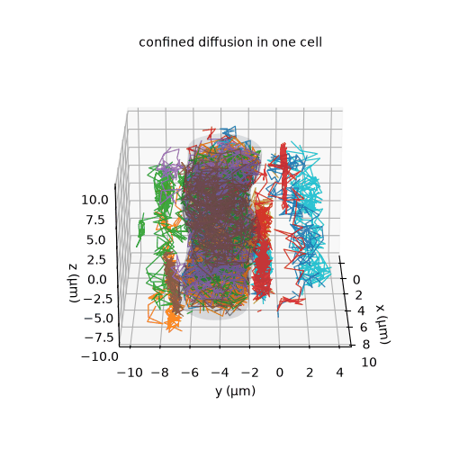
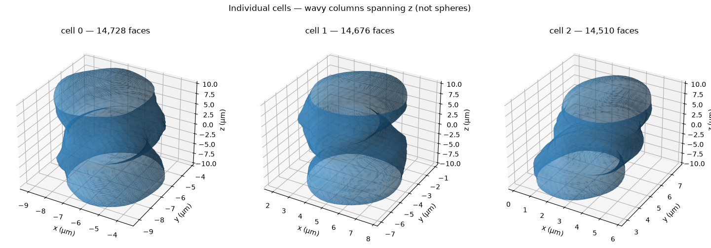
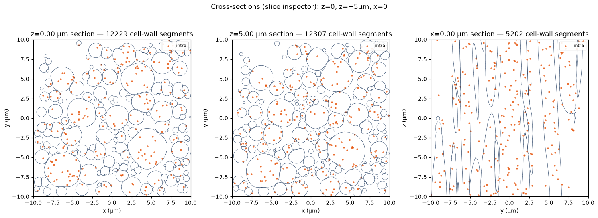

# Mesh substrates

Load a real microstructure as a triangle mesh and walk spins through it: a segmented axon bundle,
a CATERPillar or MC/DC substrate, anything closed or 3-D periodic. A `Mesh` is a `Geometry` like
any other, so every driver, every physics effect and every acquisition apply unchanged.

```python
# docs: skip  (needs a .ply file)
from dmipy_sim import Mesh, simulate, pgse

mesh = Mesh.from_ply("substrate.ply", scale=1e-5,                    # normalised coordinates -> metres
                     periodic=True, voxel_min=[-10e-6] * 3, voxel_max=[10e-6] * 3,
                     feature_radius=1.7e-6, permeability=2e-5)
mesh.quality_report()                                                # per-effect resolution verdict
seq = pgse([[1, 0, 0]] * 3, 0.010, 0.030, bvalues=[0, 1e9, 2e9])
E   = simulate(50_000, 2e-9, waveform=seq, geometry=mesh)
```

## What makes it work

- **A spatial grid with ghost triangles** makes a step cost independent of mesh size, so a million
  triangles are tractable; a 3-D-periodic pack wraps walkers across the box.
- **Smooth normals and an exact hit floor** keep walkers inside their compartment: zero crossings
  is an output guarantee, checked, not a hope.
- **`feature_radius`** names the smallest feature the walk must resolve; `quality_report()` says
  whether the step and the save grid resolve it for diffusion, surface relaxivity and permeability.

## Look inside

{ width="55%" }

{ width="100%" }

{ width="100%" }

```python
# docs: skip  (needs a .ply file)
from dmipy_sim import Mesh, plot_mesh_3d, seed_in_cell, walk_paths, plot_mesh_section, save_rotation
from dmipy_sim.viz import _split_cells

cell  = _split_cells(mesh)[1]                       # an interior cell
paths = walk_paths(mesh, 16, 500, diffusivity=2e-9, dt=2e-4, r0=seed_in_cell(cell, 16))
ax = plot_mesh_3d(mesh, cells=(1,), paths=paths)    # transparent cell + confined paths
save_rotation(ax, "cell_spin.gif")
```

Meshes carry surface relaxivity and permeability like the analytic geometries, and a mesh walk can
be stored as a replay pack and replayed under any acquisition ([Simulate](sim.md)).
