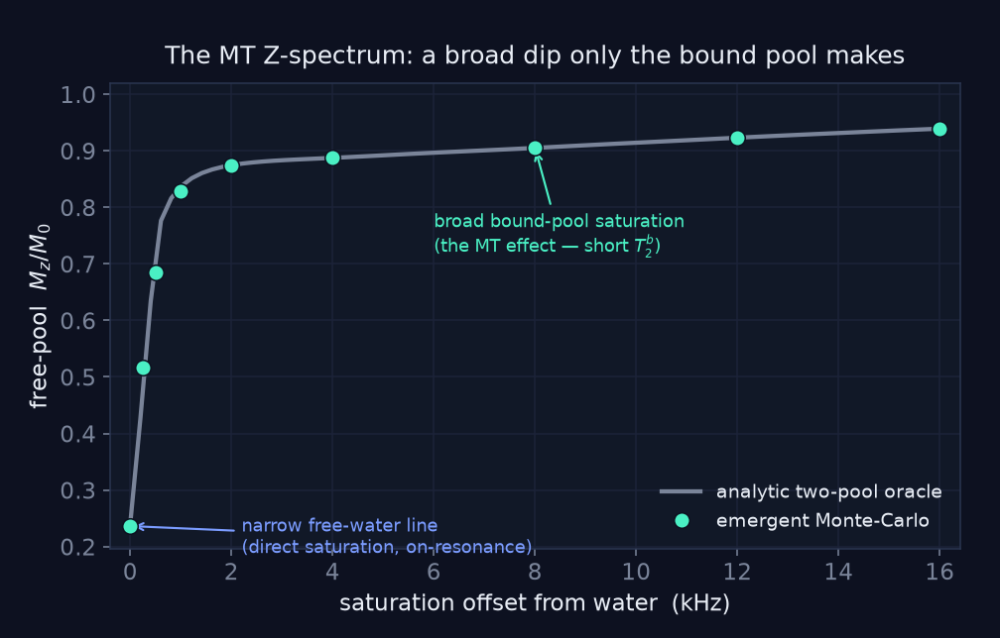

# Magnetization transfer

Protons bound to macromolecules (myelin lipids and proteins) have a T2 of microseconds and are
invisible on their own, but they trade places with free water. In dmipy-sim that trade is not a
rate law bolted onto the signal: water walkers **stick to the myelin wall**, sit in the dark bound
pool for a dwell time, and come back. The two-pool behaviour emerges from the walk, and its rate
scales with the wall area a spin sees, the same S/V that drives surface relaxivity.

<video autoplay loop muted playsinline controls style="width:100%;max-width:960px;border-radius:8px">
  <source src="../../media/mt_burnin.mp4" type="video/mp4">
</video>

Left: one myelinated cylinder in a periodic cell, walkers teal while free and amber while bound.
Right: the bound fraction, starting from zero and settling at the thermal equilibrium
f_b = k_f / (k_f + k_r) (dashed) with nothing imposing that value.

## Three rules

- **Binding** (k_f): a walker that contacts the myelin sticks with probability
  min(1, 2 (κ_MT / D) ℓ), ℓ the boundary local time of the hit, the same wall-contact statistic
  surface relaxivity uses; so k_f = κ_MT · S/V.
- **The dark pool**: a bound walker is frozen in place with the myelin's ultra-short T2, so it is
  MR-invisible while stuck.
- **Release** (k_r): it stays for a dwell time drawn from k_r = 1/τ_dwell, then rejoins the walk.

No lineshape and no Bloch–McConnell matrix enter the forward pass. Because a fresh walk starts
with the bound pool empty, the engine runs an RF-off, gradient-off **burn-in** until the
occupancy plateaus, and refuses to fire a sequence on an under-burned walk.

## Where it sits in the gate

MT is the one effect the [coherence gate](coherence_gating.md) splits. Its transverse pathway
drains the free pool during encoding and enters the apparent transverse rate as k_f, in the same
S/V form as surface relaxivity; its longitudinal saturation transfer exchanges M_z in both states
and survives storage. A stimulated echo pauses the first and still pays the second.

## The Z-spectrum

Sweep a saturation pulse across offsets from the water line and record the surviving longitudinal
signal. The free line is touched only near resonance; the bound pool's short T2 keeps absorbing
far off-resonance, so the free signal stays depressed there. That dip is something only a bound
pool can make: MT's fingerprint, and the observable that separates transfer from surface relaxivity.

`dmipy_sim.emergent_z_spectrum(offsets_hz, geometry, ...)` runs a real walk at each offset. The
oracle it is checked against is a **full** two-pool Bloch–McConnell model carrying all three
magnetization components of both pools, with the bound pool's real short T2 doing the dephasing
and no super-Lorentzian lineshape or phenomenological absorption rate; the emergent points land on
it to the Monte-Carlo noise floor.
