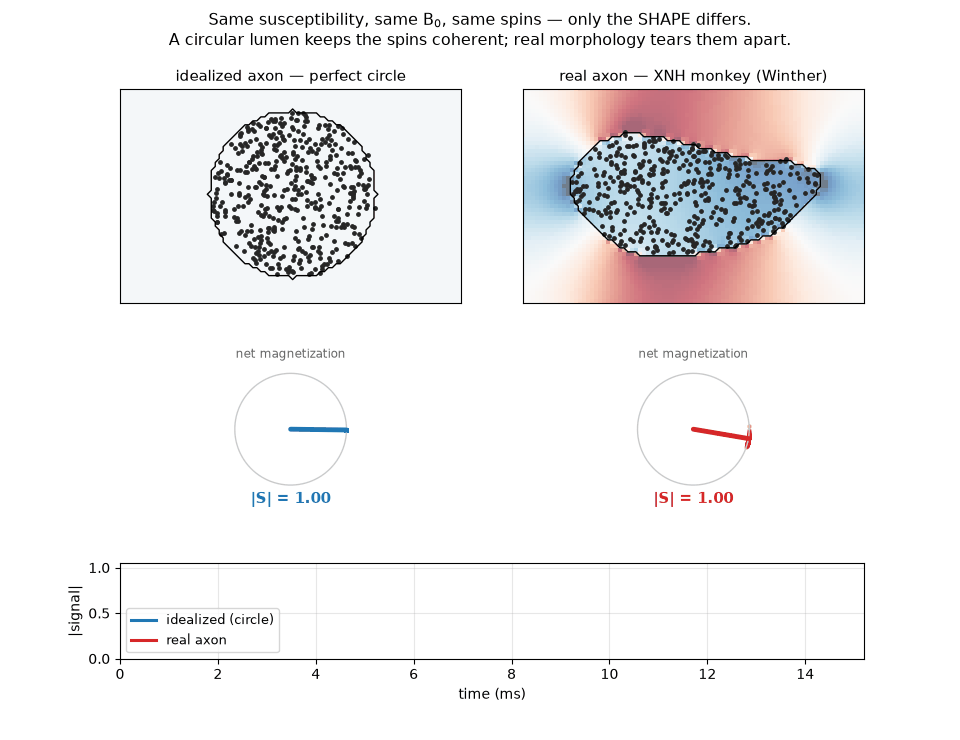
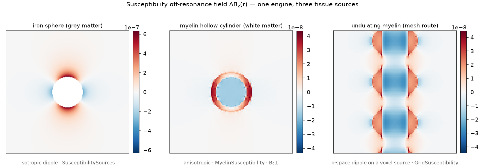
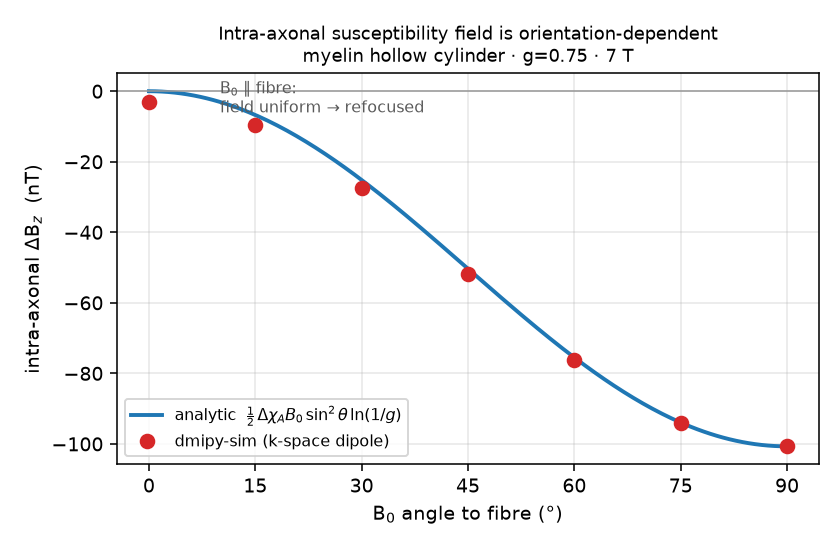
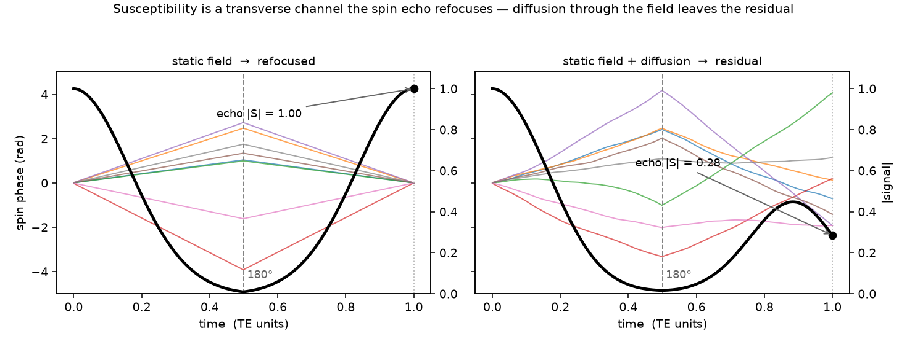

# Susceptibility

!!! success "✅ Released in dmipy-sim"
    Magnetic susceptibility is a **released** effect in the public [dmipy-sim](../sim.md) forward
    Bloch engine, validated against exact analytics and published Monte-Carlo findings. The
    matched analytical inverse (the $R_2'$ term in the [coherence-gating](coherence_gating.md)
    law) follows the same release path as the other effects.

Tissue components perturb the local magnetic field — myelin in white matter (an
orientation-dependent hollow-cylinder law) and non-heme iron / deoxyhaemoglobin in grey
matter (a static-dephasing field around impermeable cells). Each source produces an
off-resonance field $\Delta B_z(\mathbf r)$; a diffusing spin accrues an extra phase
$\gamma\int \Delta B_z(\mathbf r(t))\,dt$ on top of the gradient phase, read through the
*same* substrate as diffusion, relaxation and exchange.

{ width="100%" }

**This is the whole story in one loop.** The top row is each axon in 3-D — a generated
myelinated cylinder and the real XNH monkey axon mesh (Winther's G6 segmentation), same
orientation — with a cutting plane marking where the cross-section below is taken. In the
cross-section the two lumens carry *identical* susceptibility, main field and spins. Inside
the circle the internal field is uniform, so every spin precesses together and the net
magnetization only rotates (|S| stays 1). Inside the real, non-circular lumen the field varies
from point to point, the spins fan out on the phasor clock, and the signal collapses. The
susceptibility-induced dephasing **reads out the morphology** — the Winther 2024 finding, live.

{ width="100%" }

## One engine, three sources

The field enters the walk as a per-step z-precession $\gamma\,\Delta B_z(\mathbf r)\,dt$;
$\Delta B_z$ comes from whichever source describes the tissue:

- **`SusceptibilitySources`** — isotropic magnetised spheres (grey-matter iron,
  vasculature): superposed uniformly-magnetised-sphere dipoles (Schenck 1996).
- **`MyelinSusceptibility`** — the anisotropic hollow-cylinder myelin field
  (Wharton & Bowtell 2012) in closed form; the intra-axonal offset is
  $\tfrac12\,\Delta\chi_A B_0 \sin^2\!\theta\,\ln(1/g)$ — uniform inside the lumen and
  zero when $B_0\parallel$ fibre.
- **`GridSusceptibility`** — an arbitrary distribution voxelised onto a grid and solved by
  the Lorentz-corrected k-space dipole model (Salomir 2003; Marques & Bowtell 2005). This
  is the route for real morphology — a segmented axon, an undulating sheath, any mesh.

{ width="62%" }

The intra-axonal field is **orientation-dependent** and vanishes when $B_0\parallel$ fibre —
where the internal field is uniform and the echo refocuses it completely — which is exactly
why susceptibility reads out fibre orientation and morphology.

Because the field precesses the spin at its current position, it **composes with the other
effects in one pass**: a substrate can carry diffusion, magnetization transfer and
susceptibility together, and the sequence's own 180° pulse refocuses the *static* part of
the field exactly as in a real spin echo — so a stimulated echo parks it alongside surface
relaxivity, and the diffusion-driven residual is what survives.

{ width="80%" }

The 180° pulse refocuses the **static** part of the field exactly (the echo returns to full
signal), so only the **diffusion-driven** part survives — the piece that actually carries
microstructure.

```python
from dmipy_sim import (run_bloch_sequence, spin_echo, Cylinder, MyelinSusceptibility)

susc = MyelinSusceptibility(centers=[[0, 0]], inner_radii=[2e-6], outer_radii=[3e-6],
                            L=20e-6, delta_chi_a=-0.1e-6, B0=7.0, theta=1.57)   # B0 ⊥ fibre
seq  = spin_echo(TE=40e-3, dt=1e-4)
S    = run_bloch_sequence(seq, n_walkers=50_000, diffusivity=0.6e-9,
                          geometry=Cylinder(radius=2e-6, orientation=(0, 0, 1)),
                          susceptibility=susc)
```

## In the coherence-gating law

In the [coherence-gating](coherence_gating.md) pair susceptibility is a purely *transverse*
channel — the $R_2'$ term of the apparent transverse rate,

$$
\frac{1}{T_2^{\mathrm{app}}} = \frac{1}{T_2} + \rho_2\,\frac{S}{V} + R_2' + k_f ,
$$

acting only while the magnetization is transverse ($\chi_\perp{=}1$), with **no**
counterpart in $1/T_1^{\mathrm{app}}$: longitudinal storage pauses it over the mixing time.

!!! tip "Validation against the literature"
    The field solver is checked against exact analytics — isotropic sphere (zero internal
    field, Lorentz) and cylinder; the anisotropic hollow-cylinder intra field
    $\tfrac12\,\chi_A B_0 \sin^2\!\theta\,\ln(1/g)$ — and against published Monte-Carlo
    findings on real segmented monkey axons (Winther et al. 2024).
