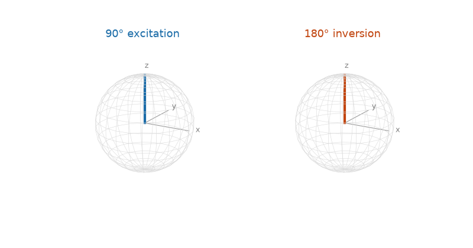
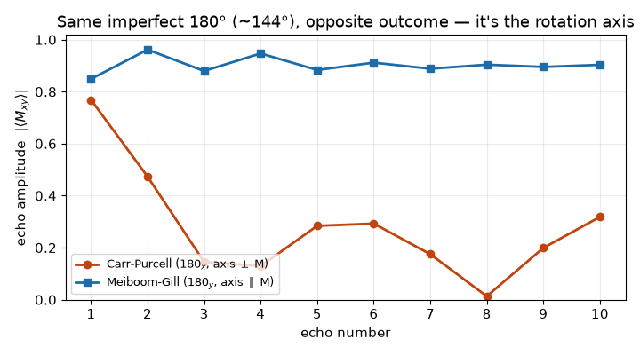
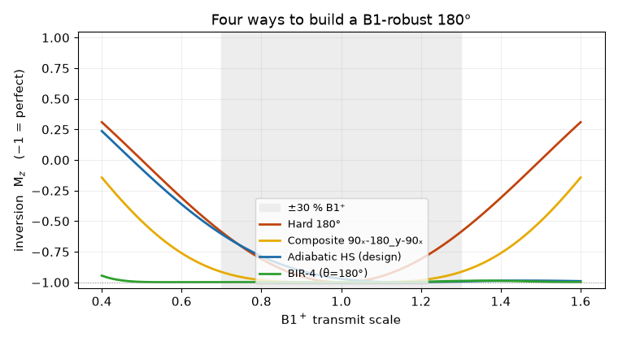
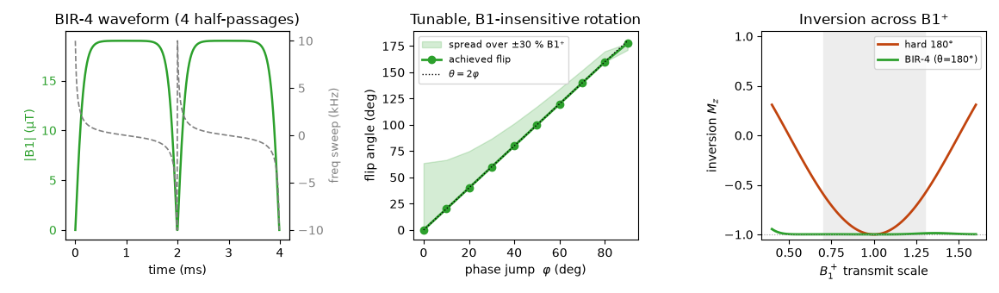

# RF pulses — watch the spins

dmipy-sim represents an RF pulse the same way it represents a gradient: as the **actual
waveform you play on the coil**. A [`Waveform`](sim.md) is the gradient $G(t)$; a **`B1Pulse`**
is the complex transmit field

$$B_1(t) = B_{1x}(t) + i\,B_{1y}(t) \quad \text{[Tesla]}$$

on a uniform raster. The magnitude sets the nutation rate $\gamma|B_1|$; the phase sets the
rotation axis. Everything else — a 90°, a 180°, a slice-selective sinc — is just a *shape*, and
the forward plays whatever you hand it.

!!! note "The forward has no intent"
    `bloch_simulate` doesn't know a pulse is "excitation" or "refocusing" — it integrates the
    Bloch equation for the $B_1(t)$ you give it and reports what the magnetisation does. The
    *intelligence* — choosing a pulse to hit a goal under hardware limits — lives one layer up, in
    [dmipy-design's RF optimiser](design/rf.md). This page is the forward; that page is the
    optimiser in front of it.

## The zoo: shapes are conveniences on top of $B_1(t)$

```python
from dmipy_sim.rf import B1Pulse, bloch_simulate, slice_profile

# constructors are conveniences — the ground truth is always the B1(t) array
exc  = B1Pulse.hard(flip_deg=90,  duration=1e-3, dt=1e-6)          # rectangular 90°
inv  = B1Pulse.hard(flip_deg=180, duration=1e-3, dt=1e-6)          # rectangular 180°
sinc = B1Pulse.windowed_sinc(90, 2.56e-3, 1e-5, time_bw=4)         # slice-selective
free = B1Pulse.from_samples(my_complex_b1_array, dt=1e-5)          # anything at all

exc.peak_b1, exc.sar_proxy, exc.nominal_flip_deg   # amplitude / SAR / area
inv.is_deliverable("ge_signa_premier_3T")          # vs the scanner catalogue
```

## Excitation vs inversion

Hand the forward a 90° and a 180° hard pulse of the same duration — same code path, different
area. The 90° tips the magnetisation from $+z$ into the transverse plane (signal you can read);
the 180° drives it through to $-z$ (inversion, the basis of a refocusing or an IR prep).

{ width="90%" }

```python
_, _, hist = bloch_simulate(exc, df_hz=0.0, return_history=True)   # M at every raster step
Mxy, Mz = bloch_simulate(inv, df_hz=0.0)                           # end-state only
```

## Slice selectivity and the frequency dual

Under a slice-select gradient, a spin at position $z$ sees an off-resonance
$\tfrac{\gamma}{2\pi}G_{ss}z$, so the **excitation profile in space is (small-tip) the Fourier
transform of the $B_1$ envelope**. A rectangular hard pulse therefore excites a *sinc* in
frequency/space (ripples everywhere — no selectivity); a windowed **sinc** pulse excites a
near-**rectangular** slice.

{ width="100%" }

```python
z, Mxy, Mz = slice_profile(sinc, slice_gradient=20e-3, positions_m=z)   # T/m, metres
```

## Refocusing trains: Carr-Purcell vs Meiboom-Gill

The *phase* of a pulse is its rotation axis — and that choice can make or break an echo train.
In a CPMG train the 180° pulses are never exactly π (here B1⁺ = 0.8 makes them ~144°), and the
axis decides what happens to that error:

- **Carr-Purcell** — 180ₓ, axis *perpendicular* to the transverse magnetisation. The flip error
  tips spins out of plane a little each echo and the errors **accumulate** — the train collapses.
- **Meiboom-Gill** — 180_y, axis *parallel* to the magnetisation (the 90ₓ left M along ∓y). The
  error on an odd echo is **undone on the next even echo** — the train is self-correcting.

Same imperfect pulse, opposite outcome, from one 90° phase shift. This is just `B1Pulse` phases
through the forward:

{ width="80%" }

```python
refoc_cp = B1Pulse.hard(180, 4e-3, 1e-5, phase_deg=0)    # axis ⟂ M  → errors accumulate
refoc_mg = B1Pulse.hard(180, 4e-3, 1e-5, phase_deg=90)   # axis ∥ M  → self-correcting
```

## Robust refocusing: a small taxonomy

A hard 180° only inverts properly at the nominal transmit strength. There are three classic
ways to make it **B1-robust**, and dmipy plays all of them through the same forward:

{ width="80%" }

- **Composite** (`90ₓ-180_y-90ₓ`) — robustness from a designed *sequence* of simple rotations;
  build it by concatenating hard segments with different phases.
- **Adiabatic HS** — robustness from a continuous frequency *sweep*: the magnetisation follows
  the effective field. This is what [`design_refocusing_rf`](design/rf.md) produces.
- **BIR-4** — an adiabatic pulse that rotates by *any* angle B1-insensitively (below).

```python
# composite: robustness from discrete rotations
seg = lambda f, ph: B1Pulse.hard(f, abs(f)/180*0.6e-3, 1e-5, phase_deg=ph).b1
composite = B1Pulse.from_samples(np.concatenate([seg(90,0), seg(180,90), seg(90,0)]), 1e-5)
```

## The exotic: BIR-4, a B1-insensitive rotation by any angle

**BIR-4** (B1-Independent Rotation, 4 segments; Garwood & Ke 1991) is built from four adiabatic
half-passages with an alternating frequency sweep and two phase jumps. Where an adiabatic full
passage can only *invert*, BIR-4 rotates by an **arbitrary angle set by the phase jump** ($\theta
\approx 2\varphi$) — and does so B1-insensitively. It's the most robust refocusing element here,
flat across the entire ±60% B1⁺ range:

{ width="100%" }

Every pulse on this page — excitation, refocusing, slice-selective, CPMG, composite, adiabatic,
BIR-4 — is the *same* `B1Pulse` object through the *same* Bloch forward. dmipy-sim provides the
`hard` / `windowed_sinc` constructors and the representation; the richer pulses are recipes on
top, and the optimised ones come from [dmipy-design](design/rf.md).

## The forward in full

`bloch_simulate` integrates over an **ensemble** — off-resonance `df_hz` × transmit scale
`b1_scale` both broadcast — with optional `T1`/`T2` relaxation and a full `return_history`. That
ensemble is exactly what the [refocusing-RF optimiser](design/rf.md) scores against when it
designs a $B_1$-robust 180°.

## References

- **Small-tip-angle theorem.** Pauly J, Nishimura D, Macovski A. *A k-space analysis of small-tip-
  angle excitation.* Journal of Magnetic Resonance **81** (1989) 43–56.
  [doi:10.1016/0022-2364(89)90265-5](https://doi.org/10.1016/0022-2364(89)90265-5).
- **Meiboom-Gill.** Meiboom S, Gill D. *Modified spin-echo method for measuring nuclear
  relaxation times.* Review of Scientific Instruments **29** (1958) 688–691.
  [doi:10.1063/1.1716296](https://doi.org/10.1063/1.1716296).
- **Composite pulses.** Levitt MH. *Composite pulses.* Progress in NMR Spectroscopy **18** (1986)
  61–122. [doi:10.1016/0079-6565(86)80005-X](https://doi.org/10.1016/0079-6565(86)80005-X).
- **BIR-4.** Garwood M, Ke Y. *Symmetric pulses to induce arbitrary flip angles with compensation
  for RF inhomogeneity and resonance offsets.* Journal of Magnetic Resonance **94** (1991)
  511–525. [doi:10.1016/0022-2364(91)90137-I](https://doi.org/10.1016/0022-2364(91)90137-I).
- **Adiabatic pulses — review.** Tannús A, Garwood M. *Adiabatic pulses.* NMR in Biomedicine
  **10** (1997) 423–434.
