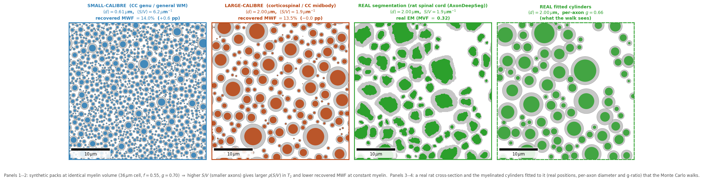
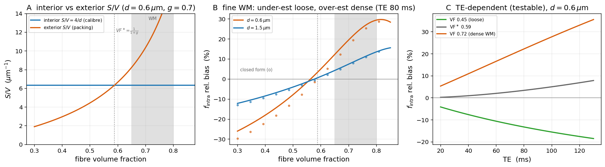
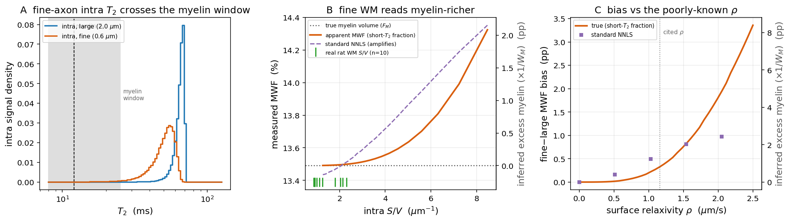

# Surface relaxivity & the myelin water fraction

**The claim, in one line:** every microstructure fit silently assumes water relaxes at a single
bulk $T_2$ — but water relaxes *faster where it touches a wall*, and intra- and extra-axonal water
touch different amounts of wall. That $S/V$-dependent shortening biases the intra-axonal signal
fraction and the myelin water fraction **before any estimator sees the signal**.

This page shows the effect the way the accompanying preprint does — *"Surface relaxivity biases
diffusion and relaxometry microstructure estimates"*
([source + PDF](https://github.com/dmrai-lab/dmipy/tree/main/papers/surface_relaxivity_bias),
reproducible with the public engines) — and lets you rerun it.

## The physics

Water at a permeable boundary loses transverse magnetisation on contact (Brownstein–Tarr). The
apparent rate a multi-echo fit sees is a **bulk rate plus a surface rate**,

$$
\frac{1}{T_{2}^{\mathrm{app}}} = \frac{1}{T_{2,\mathrm{bulk}}} + \rho\,\frac{S}{V},
$$

with $\rho \approx 1.16\,\mu$m/s the cited surface relaxivity
([Barakovic et al. 2023](https://doi.org/10.3389/fnins.2023.1209521)). Because $\rho\,(S/V)$ is
**b-independent and isotropic**, it is inseparable from bulk $T_2$ — you cannot fit it away, and it
rides through the $b{=}0$ every fraction estimator normalises by.

The two water pools have **different geometry, hence different $S/V$**: a small, densely packed
axon presents more extra-axonal wall per unit volume than a big one. The interior/exterior ratio is

$$
\frac{(S/V)_{\mathrm{int}}}{(S/V)_{\mathrm{ext}}} = \frac{1 - \mathrm{VF}}{g\,\mathrm{VF}},
\qquad \text{crossing unity at } \mathrm{VF}^\ast = \frac{1}{1+g},
$$

independent of the calibre distribution. Physiological white matter (fibre volume fraction
$\sim0.65$–$0.80$) sits **above** this crossover, so the exterior wins and surface relaxivity
**over-weights the intra-axonal signal**.



## See it happen (dmipy-sim)

A CPMG train on the canonical white-matter substrate, one Monte-Carlo walk, every walker coloured
by its magnitude $|M|$. Without surface relaxivity each pool would slide down as a single spike at
its bulk-$T_2$ rate; surface relaxivity gives every walker its own wall-contact history and pushes
it **below** that ceiling — intra-axonal (higher $S/V$) falls ~4 %, extra-axonal only ~1 %. That
gap *is* the apparent-$T_2$ shortening the fit misreads.

<video autoplay loop muted playsinline controls style="width:100%;max-width:1000px;border-radius:8px">
  <source src="/media/magnitude_zoom_cpmg.mp4" type="video/mp4">
</video>

More of the pedagogy (phase, spatial view) is on the [Pedagogy page](pedagogy.md).

## What it does to your numbers

**Diffusion — the intra-axonal fraction.** Above the packing crossover, surface relaxivity
over-weights the intra-axonal signal by **$\approx 12\%$** over the robust packing band at clinical
PGSE ($\mathrm{TE}=80$ ms, cited $\rho$). It *under*-estimates in loosely packed tissue and
*over*-estimates in dense white matter, crossing zero at $\mathrm{VF}^\ast=1/(1+g)$ — a **closed-form
sign law** with a testable, packing-dependent TE drift.



**Relaxometry — the myelin water fraction.** The same physics reads through a T₂ spectrum as a
*smaller* MWF bias: the thinnest axons' intra-water crosses below the ~25 ms myelin window and is
counted as myelin, so fine white matter reads **myelin-richer** (~**0.33 pp** at cited $\rho$).
That is far beneath single-voxel noise and only exposed by regional averaging — but it is
**super-linear** in the order-of-magnitude-uncertain $\rho$.



!!! note "Why this matters even though it's small"
    The MWF bias is sub-noise per voxel, but it is a **spatially structured systematic** — it
    tracks packing, so it does not average away across a region or a cohort, and it scales with a
    relaxivity known only to an order of magnitude. The $f_{\mathrm{intra}}$ bias is **first-order**
    and packing-dependent. Neither shows up unless you put the surface term in the model.

## Reproduce it from the public pair

Simulate a CPMG echo train (one walk) with **dmipy-sim**, then fit the myelin-water fraction with
**dmipy-fit** — per-compartment $T_2$ baked into the geometry, no private code:

```python
import numpy as np
import dmipy_sim as ds
from dmipy_fit.white_matter.mwf import t2_spectrum_mwf

geom = ds.MyelinatedCylinder(inner_radius=2.5e-6, outer_radius=3.57e-6, orientation=(0, 0, 1),
    D_intra=1.7e-9, D_extra=1.7e-9, D_myelin=0.1e-9,
    T2_intra=0.080, T2_myelin=0.015, T2_extra=0.080)

echo_times = np.arange(1, 33) * 8e-3
S = np.array([
    float(np.asarray(ds.simulate(
        40_000,
        waveform=ds.pgse(delta=te / 2 - 1e-4, DELTA=te / 2, G_magnitude=0.0,
                         bvecs=[[0, 0, 1]], n_t=400),
        geometry=geom, seed=1)).ravel()[0])
    for te in echo_times])
mwf, T2_grid, spectrum = t2_spectrum_mwf(S / S[0], echo_times)   # NNLS T2 spectrum -> MWF
```

Both engines take the **outer (fibre) diameter** Gamma distribution; the analytical model *derives*
the exterior $S/V$ from it with the same closed form the simulator walks, so a fit and a simulation
built from the same parameters describe the same tissue:

```python
from dmipy_fit.white_matter.composition import build_white_matter_model
model, params = build_white_matter_model(gamma_shape=2.0,
                                         gamma_scale_outer_diameter=0.30e-6,
                                         f_axon=0.55, rho2=15e-6)
```

The correction the paper proposes is a single-TE, closed-form odds rescaling that injects a
histology $S/V$ prior — it harmonises fractions across cohorts scanned at different echo times. See
the [preprint](https://github.com/dmrai-lab/dmipy/tree/main/papers/surface_relaxivity_bias) for the
full derivation, the demyelination-trajectory result, and the Monte-Carlo validation.
