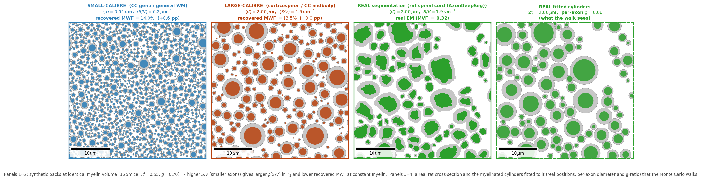
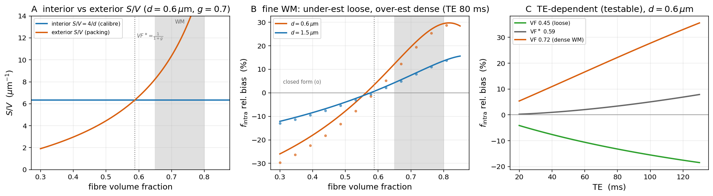
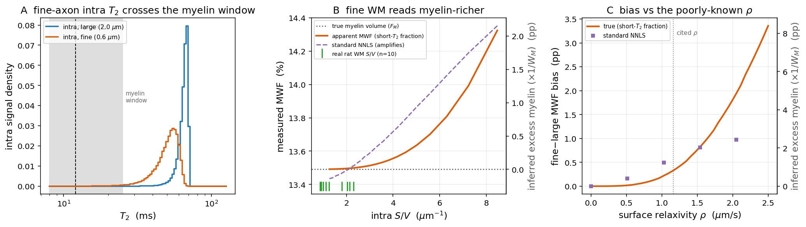

# Surface relaxivity & the myelin water fraction

Every microstructure fit assumes water relaxes at one bulk T2. Water relaxes *faster where it
touches a wall*, and intra- and extra-axonal water touch different amounts of wall. That
S/V-dependent shortening biases the intra-axonal signal fraction and the myelin water fraction
before any estimator sees the signal. This page shows the effect the way the preprint does
(*Surface relaxivity biases diffusion and relaxometry microstructure estimates*,
[source and PDF](https://github.com/dmrai-lab/dmipy/tree/main/papers/surface_relaxivity_bias))
and lets you rerun it.

## The physics

Water at a boundary loses transverse magnetisation on contact (Brownstein–Tarr). A multi-echo
fit sees a bulk rate plus a surface rate,

$$\frac{1}{T_{2}^{\mathrm{app}}} = \frac{1}{T_{2,\mathrm{bulk}}} + \rho\,\frac{S}{V},$$

with ρ ≈ 1.16 µm/s the cited surface relaxivity (Barakovic et al. 2023). The term is
b-independent and isotropic, so it cannot be fit away, and it rides through the b = 0 every
fraction estimator normalises by. The two pools have different S/V: a small, densely packed axon
presents more extra-axonal wall per unit volume than a big one,

$$\frac{(S/V)_{\mathrm{int}}}{(S/V)_{\mathrm{ext}}} = \frac{1 - \mathrm{VF}}{g\,\mathrm{VF}},
\qquad \mathrm{VF}^\ast = \frac{1}{1+g},$$

independent of the calibre distribution. Physiological white matter (VF 0.65–0.80) sits above
the crossover, so the exterior wins and surface relaxivity over-weights the intra-axonal signal.



## What it does to your numbers

**The intra-axonal fraction.** Above the packing crossover, surface relaxivity over-weights the
intra-axonal signal by about 12 % over the robust packing band at clinical PGSE (TE 80 ms, cited
ρ). It under-estimates in loosely packed tissue and over-estimates in dense white matter,
crossing zero at VF* = 1/(1+g): a closed-form sign law with a testable, packing-dependent TE drift.



**The myelin water fraction.** The same physics reads through a T2 spectrum as a smaller bias:
the thinnest axons' intra-water crosses below the ~25 ms myelin window and is counted as myelin,
so fine white matter reads myelin-richer (about 0.33 pp at cited ρ). That is beneath single-voxel
noise, but it is a spatially structured systematic that tracks packing, does not average away
across a region or a cohort, and is super-linear in a relaxivity known only to an order of
magnitude.



Watch it happen in the [spin studio](studio/spins.md): each walker carries its own wall-contact
history, and the intra-axonal pool falls below its bulk-T2 ceiling faster than the extra-axonal one.

## Reproduce it

One myelinated axon, a bare spin echo at each echo time, the walk carrying the compartments' T2;
the NNLS spectrum then reads a myelin water fraction off the decay:

```python
import numpy as np
import dmipy_sim as ds
from dmipy_fit.white_matter.mwf import t2_spectrum_mwf

geom = ds.MyelinatedCylinder(inner_radius=2.5e-6, outer_radius=3.57e-6, orientation=(0, 0, 1),
    D_intra=1.7e-9, D_extra=1.7e-9, D_myelin=0.1e-9,
    T2_intra=0.080, T2_myelin=0.015, T2_extra=0.080)

echo_times = np.arange(1, 9) * 8e-3
S = np.array([                                    # a bare spin echo at each TE: relaxation only
    float(np.asarray(ds.simulate(
        4_000,
        waveform=ds.pgse([[0, 0, 1]], te / 2 - 1e-4, te / 2, gradient_strengths=[0.0], TE=te, n_t=200),
        geometry=geom, seed=1, require_gpu=False)).ravel()[0])
    for te in echo_times])
mwf, T2_grid, spectrum = t2_spectrum_mwf(S / S[0], echo_times)   # NNLS T2 spectrum -> MWF
```

Add `surface_relaxivity_t2=` on the geometry to put the wall term in, and fit the same decay with
the canonical white-matter model, which carries the surface factors explicitly:

```python
from dmipy_fit.white_matter.composition import build_white_matter_model
model, params = build_white_matter_model(gamma_shape=2.0,
                                         gamma_scale_outer_diameter=0.30e-6,
                                         f_axon=0.55, rho2=15e-6)
```

The paper's figures regenerate from `papers/surface_relaxivity_bias/` with the public engines.
