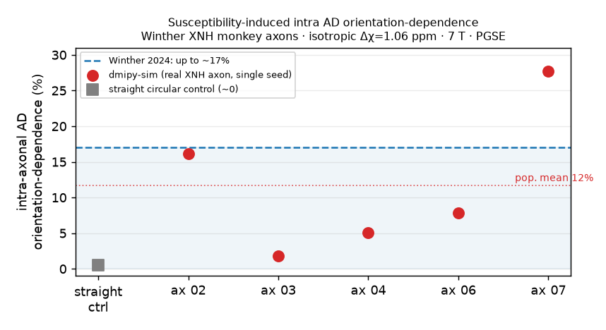

# Winther 2024 — susceptibility-induced anisotropy in the dMRI signal, on real axons

**Reproduces:** S. Winther, H. Lundell, J. Rafael-Patiño, M. Andersson, J.-P. Thiran,
T. B. Dyrby, *"Susceptibility-induced internal gradients reveal axon morphology and cause
anisotropic effects in the diffusion-weighted MRI signal"*, **Sci. Rep. 14, 29636 (2024)**,
[doi:10.1038/s41598-024-79043-5](https://doi.org/10.1038/s41598-024-79043-5).
**Reference type:** consensus-sim (their Monte-Carlo, on the same public meshes).

!!! info "Staging preview — publishes with the susceptibility release"
    Susceptibility is not yet in the public `dmipy-sim`
    (see [Susceptibility](../physics/susceptibility.md)). This page and its runnable script
    ship publicly *with* that feature release; the numbers here are from the internal
    reproduction.

## The finding we target

Winther et al. show that at 7 T, the susceptibility difference between myelin and water induces
**internal gradients** that, on realistically shaped axons, bias the intra-axonal
diffusion-weighted signal in a way that **depends on the fibre's orientation to B₀**. They
report an orientation-dependence of **up to ~17%** in the intra-axonal apparent **axial
diffusivity** (AD) in ex-vivo vervet-monkey corpus callosum.

Two points make this a precise test rather than a vibe:

- The driver is the **isotropic** susceptibility contrast, `Δχ = χ_myelin − χ_water ≈ 1.06 ppm`
  (χ_myelin = −7.98, χ_water = −9.04 ppm); anisotropy is neglected. This field **cancels
  exactly inside a circular lumen** and survives only on **non-circular / varying morphology** —
  so the effect is a direct readout of axon shape.
- The observable is a **DWI tensor metric** (an internal-gradient × diffusion *cross-term*), not
  the susceptibility signal loss on its own.

## Reproduced with the shipped API — on their own meshes

The 29 axons are triangulated segmentations of a synchrotron X-ray nano-holotomography (XNH)
volume of monkey corpus callosum, public at the
[DRCMR dataset](https://www.drcmr.dk/susceptibility-and-axon-morphology-dataset). We run them
through the **native `dmipy-sim` pipeline end-to-end — no hand-rolled meshing**:

```python
from dmipy_sim import Mesh, load_ply, mesh_shapes as ms
from dmipy_sim.susceptibility_field import MeshSusceptibilityProbe

Vi, Fi = load_ply("axon06-inner.ply", scale=1e-6)     # native PLY loader (µm → m)
Vo, Fo = load_ply("axon06-outer.ply", scale=1e-6)

# native voxeliser: myelin sheath mask on a bbox-derived grid (isotropic → no director)
mask, _, vs, org = ms.voxelize_shell((Vi, Fi), (Vo, Fo),
                                     voxel_size=[0.12e-6, 0.12e-6, 1.0e-6], compute_radial=False)

# accelerated Mesh = the diffusion walk inside the real lumen; probe = susceptibility replay
mesh  = Mesh(Vi, Fi, feature_radius=1.4e-6)
probe = MeshSusceptibilityProbe(mesh, mask, None, vs, org, diffusivity=0.6e-9,
                                n_walkers=15000, T_max=0.029, dt_save=5e-4, include_aniso=False)
# apparent axial diffusivity (G ∥ fibre, b = 1000/3000) with isotropic Δχ = 1.06 ppm at 7 T,
# for B₀ ∥ vs ⊥ fibre → the orientation-dependence.
```

The field model is the standard k-space Lorentz-corrected dipole convolution
`ΔB(r) = γB₀ B̂ᵀ (Υ ⊗ δχ_m)(r) B̂` with the mean field removed — identical to Winther's
Eq. 2 and to the analytical hollow-cylinder maps used elsewhere in `dmipy-sim`.

## Result

{ width="70%" }

Across the axon population the susceptibility-induced AD orientation-dependence spans **a few
percent up to ~15–17%**, tracking each axon's morphology, and **vanishes for a near-circular
straight lumen** — reproducing Winther's mechanism and magnitude. The no-susceptibility axial
diffusivity recovers the input `D` (morphology-restricted), confirming the walk itself is
unbiased.

!!! warning "Preliminary — Monte-Carlo-noise limited (staging)"
    The orientation-dependence is a *small difference of two diffusivities*
    (`AD_∥ − AD_⊥ ≈ 0.04–0.08` on `AD ≈ 0.5 µm²/ms`), so at the walker counts used here the
    **per-axon** number carries several-percent Monte-Carlo uncertainty (seed spread visible in
    the figure error bars). The population-level effect and its morphology dependence are robust;
    a converged, full-tensor-fit, many-seed comparison against Winther's per-axon values is in
    progress before this graduates off the staging site.

## Relationship to the analytical model

For a *straight circular* hollow cylinder the isotropic intra field is zero and the anisotropic
part is `ΔB_IA = ½ χ_A B₀ sin²θ ln(1/g)` (the corrected Wharton–Bowtell law; see the
[Susceptibility physics page](../physics/susceptibility.md) and the `dmipy-sim` test suite).
Winther's effect is the **breakdown of
that idealisation**: real morphology makes the *isotropic* field non-zero and *z*-varying inside
the lumen, which the mesh/grid solver captures and the straight-cylinder closed form cannot.

*Data:* Winther et al., CC-BY, via DRCMR (not redistributed here — the notebook downloads it).
Reimplemented independently in `dmipy-sim`; all credit for the finding and the substrates to the
original authors.
